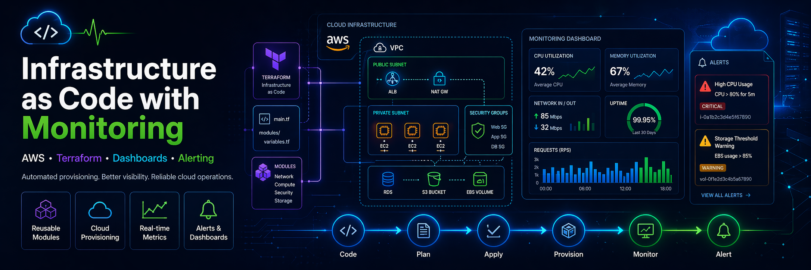

# Infrastructure as Code with Monitoring

This project demonstrates how to provision and manage AWS infrastructure using **Terraform**, while improving visibility through **monitoring dashboards and alerting**.

The main goal of this project is to show how infrastructure setup can be automated in a repeatable way instead of being created manually, while also adding basic observability for system health and operational awareness.

---

## Overview

This project focuses on two core DevOps practices:

* **Infrastructure as Code (IaC)** using Terraform
* **Monitoring and alerting** for better infrastructure visibility

By defining infrastructure through code, the environment can be created consistently across deployments. Monitoring adds visibility into resource health, usage, and potential issues, helping improve reliability and operational awareness.

---

## My Contribution

The primary work completed in this project includes:

* Writing **Terraform configuration and reusable modules** to provision AWS infrastructure
* Automating infrastructure setup to reduce manual provisioning effort
* Configuring **monitoring dashboards and alerting mechanisms**
* Organizing the project to reflect a practical DevOps workflow with version-controlled infrastructure

---

## Key Objectives

* Automate AWS resource provisioning using Terraform
* Reduce manual setup effort and improve repeatability
* Improve observability through dashboards and alerts
* Demonstrate a practical DevOps workflow using Infrastructure as Code

---

## Tech Stack

**Cloud:** AWS
**Infrastructure as Code:** Terraform
**Monitoring:** CloudWatch / Grafana / Prometheus *(use whichever applies to your actual repo)*
**Other Tools:** Git, Linux

---

## Project Structure

```text
.
├── modules/               # Reusable Terraform modules
├── environments/          # Environment-specific Terraform configuration
├── monitoring/            # Monitoring or dashboard-related configuration
├── main.tf                # Main infrastructure definition
├── variables.tf           # Input variables
├── outputs.tf             # Output values
├── provider.tf            # Provider configuration
└── README.md              # Project documentation
```

> Update the structure above if your actual repository folders are different.

---

## What This Project Provisions

This project is designed to provision AWS infrastructure in an automated and repeatable way.

Depending on your current implementation, it may include resources such as:

* Virtual network components
* Compute resources
* Security groups
* Storage or supporting services
* Monitoring and alerting configuration

You should edit this section to match your exact AWS resources.

Example:

* VPC
* Subnets
* EC2 instances
* Security Groups
* CloudWatch alarms
* Dashboard configuration

---

## Terraform Workflow

### Initialize Terraform

```bash
terraform init
```

### Validate configuration

```bash
terraform validate
```

### Review execution plan

```bash
terraform plan
```

### Apply infrastructure

```bash
terraform apply
```

### Destroy infrastructure

```bash
terraform destroy
```

---

## Monitoring Setup

Monitoring is included to improve infrastructure visibility and help identify system issues early.

This project can include:

* Resource-level monitoring dashboards
* Health and usage metrics
* Alerting for threshold-based events
* Basic observability for operational awareness

Example monitoring use cases:

* CPU utilization alerts
* Memory or storage monitoring
* Instance health checks
* Dashboard-based visibility into infrastructure performance

---

## Benefits of This Approach

* **Repeatable deployments** using version-controlled infrastructure
* **Reduced manual setup effort** compared to traditional provisioning
* **Improved visibility** through dashboards and alerts
* **Better operational consistency** across environments

---

## Use Case

This project is useful for demonstrating how DevOps teams can:

* provision cloud resources faster
* reduce configuration drift
* standardize infrastructure setup
* improve infrastructure monitoring and reliability

It is designed as a practical learning project to strengthen skills in Terraform, AWS, monitoring, and infrastructure automation.

---

## Important Notes

* This project is intended to demonstrate **Infrastructure as Code and monitoring concepts**
* Resource definitions and monitoring configuration should be reviewed before deployment in a real environment
* Costs may apply when provisioning AWS resources
* Monitoring tools and dashboards should be customized based on the infrastructure being deployed

---

## Resume-Friendly Project Summary

This project can be described as:

* Developed reusable **Terraform modules** to provision AWS infrastructure in a repeatable and automated manner
* Reduced manual setup effort by automating infrastructure provisioning workflows
* Configured **monitoring dashboards and alerting mechanisms** to improve infrastructure visibility and operational awareness

---

## Future Improvements

Possible next steps for this project:

* Add support for multiple environments such as dev, test, and prod
* Integrate the Terraform workflow into a CI/CD pipeline
* Add remote Terraform state management
* Expand monitoring coverage with more detailed dashboards and alerts
* Add validation, formatting, and security checks for Terraform code

---

## License

This project is intended for learning and portfolio demonstration purposes.
